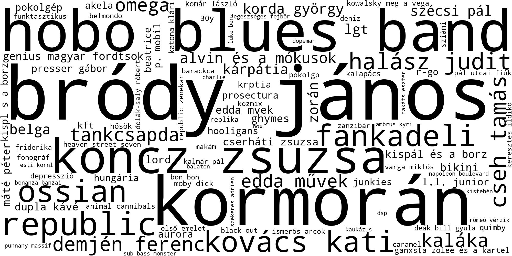

# Hungarian popular music lyrics experiments

<p align="center">
    
</p>

The repository contains the dataset (without the lyrics) and the  Python code of the experiments 
described in the paper "...". 
The programs can be run using command-line options as described below, covering the main experiments
performed. The code is available for all experiments described in the paper (e.g., validation of
the lexicon-based sentiment prediction method on two datasets), but can only be run from code.

The dataset is located in the `data` folder (the `lyrics` field contains only the first 30 characters of the song lyrics): <a href="data/lyrics_metadata_genres_public.json">lyrics_metadata_genres_public.json</a>.

## Genre categorization with multinomial naive Bayes

Multiclass and one-vs-one classification:
```
python3 tc.py --multiclass
python3 tc.py --ovo
```

## Lyrics complexity

```
python3 complexity.py [--fk|--gzip] [--genres|--playcount]
```
where
- `fk` - Flesch-Kincaid readability
- `gzip` - gzip compression ratio
- `genres` - complexity for genres
- `playcount` - complexity vs playcount plot

## Sentiment analysis

```
 python3 sentiment.py [--idf]
```
- `idf` - use inverse document frequency weighting
